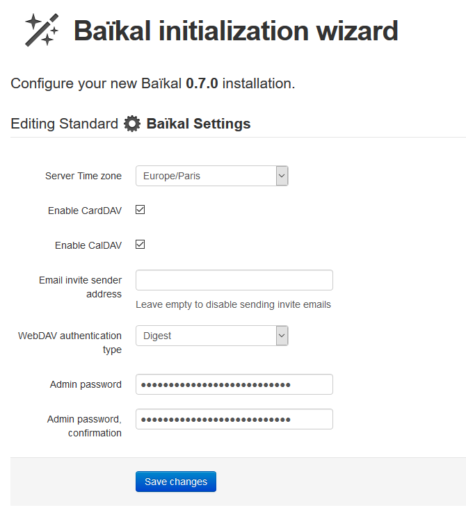

# Kalender und Kontakte mit Baikal sicher verwalten

## Inhaltsverzeichnis

- [Einleitung](#einleitung)
- [Alternativen](#alternativen)
- [Baikal](#baikal)
- [Setup](#setup)
  - [Raspberry PI vorbereiten](#raspberry-pi-vorbereiten)
  - [Baikal Installation](#baikal-installation)
  - [Webserver-Konfiguration](#webserver-konfiguration)
  - [Baikal Ersteinrichtung](#baikal-ersteinrichtung)
  - [Benutzereinrichtung](#benutzereinrichtung)
  - [Maildienst Einrichtung (optional, nur für Einladungsmails)](#maildienst-einrichtung-optional-nur-f%C3%BCr-einladungsmails)
- [Baikal-Update](#baikal-update)
- [Benutzerlogin](#benutzerlogin)
- [Freigabe des Kalenders für andere Benutzer](#freigabe-des-kalenders-für-andere-benutzer)
- [Gemeinsame Kontakte](#gemeinsame-kontakte)
- [Zugriff](#zugriff)
  - [Thunderbird](#thunderbird)
    - [Kalender in Thunderbird](#kalender-in-thunderbird)
    - [Kontakte in Thunderbird verwalten](#kontakte-in-thunderbird-verwalten)
  - [Apple](#apple)
  - [Android](#android)
    - [Übertragen der Kontakte vom vorherigen Speicherort zu DAVx<sup>5</sup>](#übertragen-der-kontakte-vom-vorherigen-speicherort-zu-davx5)
  - [Browser](#browser)
  - [Erfolgskontrolle](#erfolgskontrolle)
- [Zugriff von unterwegs (Fortgeschritten)](#zugriff-von-unterwegs-fortgeschritten)
  - [Exkurs: Was tun ohne öffentliche IP-Adresse](#exkurs-was-tun-ohne-öffentliche-ip-adresse)
- [Haltbarkeit der SD-Karte verlängern](#haltbarkeit-der-sd-karte-verlängern)
- [Backup](#backup)
- [Datenbank verkleinern (nur für Experten)](#datenbank-verkleinern-nur-für-experten)
- [Weboberfläche](#weboberfläche)
- [Stromsparen beim Raspberry-PI](#stromsparen-beim-raspberry-pi)
  - [Abschalten des HDMI-Ausgangs](#abschalten-des-hdmi-ausgangs)
  - [LEDs abschalten](#leds-abschalten)
  - [Netzteil](#netzteil)
 - [Creative Commons Lizenz](#creative-commons-lizenz)

## Einleitung

In diesem Tutorial geht es darum mit Baikal einen eigenen Kalender- und
Kontakte-Server aufzusetzen. Hierfür hat sich für Kalender der CalDAV
Standard etabliert, während es für Kontakte der CardDAV Standard ist. In
dieser Anleitung wird, je nach Gebiet, mehr oder weniger ausführlich
darauf eingegangen einen eigenen Server aufzusetzen.

## Alternativen

Bevor wir mit der Installation beginnen, hier ein paar Alternativen:

- Radicale: Webinterface ist standardmäßig nur auf localhost erreichbar.
Die Oberfläche sieht im Vergleich zu Baikal altbacken aus. Freigabe von
Kalendern zwischen Benutzern ist nicht direkt möglich. Lediglich über Umwege durch den Administrator kann es mit Verknüpfungen im Dateisystem realisiert werden. 
Ein automatisiertes Senden von Einladungsmails wie [unten beschrieben](#maildienst-einrichtung-optional-nur-f%C3%BCr-einladungsmails) ist nicht möglich.

- DAViCal: Sehr mächtiger Funktionsumfang, auch das Freigeben von Kalendern.
Ist aber aufwendiger, da unbedingt eine PostgreSQL-Datenbank benötigt wird.
Funktionsumfang eignet sich eher für kleine Firmen/Teams, da Berechtigungen
auch auf Gruppenebene vergeben werden können. So ist es z.B. möglich zu
sehen, ob ein anderer Benutzer „frei" ist oder schon einen Termin hat.
Wer sich dafür interessiert, kann [hier](https://www.youtube.com/watch?v=XH0wOLOgLwI)
ab 13:42 einen Einblick in die Administrationsoberfläche und ein paar
Erklärungen bekommen.

- Nextcloud: Bietet weit mehr als eine Kalender- und Kontaktesynchronisation.
War aber selbst auf dem Raspberry PI 4 mit 2 GB RAM ziemlich langsam. Für
Dateisynchronisierungen bevorzuge ich lieber Syncthing. Auch den
Einrichtungsaufwand fand ich vergleichsweise hoch. Liegt wohl daran,
dass es viel mehr zu tun gibt, weil es deutlich mehr als nur Kalender-
und Kontaktesynchronisationen bietet.

## Baikal

Kommen wir nun zu dem Programm mit dem wir uns in dieser Anleitung
beschäftigen: Baikal

Download unter [https://github.com/sabre-io/Baikal](https://github.com/sabre-io/Baikal)

Es benötigt eine lauffähige PHP-Umgebung und kann damit prinzipiell auf
allen Systemen installiert werden, auf denen ein Webserver mit PHP
verfügbar ist. Es kann mit einer MySQL-Datenbank arbeiten, aber genauso
mit SQLite, einer Datenbank in einer einzigen Datei. Das ist die für uns
bevorzugte Variante, da dies erheblich weniger Konfigurationsaufwand
erfordert und viel portabler ist. Es braucht lediglich das
Baikal-Verzeichnis gesichert zu werden um auf ein anderes System
umzuziehen. Es bietet gleichzeitig die Möglichkeit einen Kalender für
andere Benutzer freizugeben. Für eine Familie ist der Funktionsumfang
vollkommen ausreichend. Dank Betrieb auf einem Raspberry PI-Zero W
beträgt der Stromverbrauch weniger als 1 Watt. Die Leistung eines
Raspberry PI Zero W ist im Betrieb vollkommen ausreichend. Solltet ihr
einen leistungsfähigeren Raspberry PI zur Verfügung haben, könnt ihr die
Baikal-Einrichtung auch auf diesem ausführen und dann die SD-Karte in
den endgültigen Rasbperry-PI Zero W umstecken. Richtet in diesem Fall
die Konten in Thunderbird und DAVx<sup>5</sup> bitte erst danach ein, weil sich
wahrscheinlich die IP-Adresse eures Raspberry PIs ändert. Gegebenenfalls
solltet ihr in eurem Router einrichten, dass er immer dieselbe
IP-Adresse bekommt, sonst ist er eventuell nicht mehr unter der
eingerichteten Adresse erreichbar. Bei einer Fritzbox ist das nicht
notwendig, sofern der Raspberry PI immer läuft (kurze Unterbrechungen
natürlich ausgenommen).

## Setup

In diesem Beispiel nehmen wir einen Raspberry PI mit Nginx als
Webserver. Als Basis nehmen wir ein Raspbery PI OS Lite Image und
flashen es via Etcher auf eine SD-Karte.

### Raspberry PI vorbereiten


Wer hier weitere Unterstützung braucht, kann z.B. nach dieser Anleitung
[https://tutorials-raspberrypi.de/rapbian-betriebssystem-raspberry-pi-image-sd-karte-flashen-windows-mac-linux/](https://tutorials-raspberrypi.de/rapbian-betriebssystem-raspberry-pi-image-sd-karte-flashen-windows-mac-linux/)
vorgehen. Raspbian Buster Lite findet man auf
[https://www.raspberrypi.org/software/operating-systems/#raspberry-pi-os-32-bit](https://www.raspberrypi.org/software/operating-systems/#raspberry-pi-os-32-bit)

Nach dem Schreiben des Abbilds auf die SD-Karte, nehmen wir sie kurz aus
dem Kartenleser und stecken sie wieder ein. Dadurch bekommen wir nun
Zugriff auf ein Laufwerk namens `Boot`. Die Fehlermeldungen können
ignoriert werden. Jetzt erstellen wir eine Datei `ssh.txt` (oder auch nur
ssh möglich). Wer einen Raspberry PI Zero W verwendet, kann auch eine
`wpa_supplicant.conf` hier ablegen, damit der PI automatisch den Weg ins
WLAN findet.

Eine Anleitung hierfür findet sich unter
[https://pi-buch.info/wlan-schon-vor-der-installation-konfigurieren/](https://pi-buch.info/wlan-schon-vor-der-installation-konfigurieren/)
Auch wenn dort von Raspbian Stretch (=Vorgängerversion) die Rede ist,
funktioniert der dort beschriebene Weg genauso.


Anschließend starten wir den Raspberry-PI. Via SSH können wir uns nun
verbinden. Wer hierbei Unterstützung braucht, findet sie hier
[https://www.elektronik-kompendium.de/sites/raspberry-pi/2206121.htm](https://www.elektronik-kompendium.de/sites/raspberry-pi/2206121.htm)

Die IP bekommt man meistens mit einem `ping raspberrypi` oder `ping
raspberrypi.local` heraus. Ansonsten kann man auch mal im Router bei den
Netzwerkgeräten nachsehen. Weitere Hilfe zum Herausfinden der IP gibt's
unter
[https://www.elektronik-kompendium.de/sites/raspberry-pi/1906271.htm](https://www.elektronik-kompendium.de/sites/raspberry-pi/1906271.htm)

Als erstes wird das System auf den aktuellen Stand gebracht.

```sh
sudo apt update && sudo apt upgrade -y
```

Je nach Paketen, z.B. bei Firmware oder Kernel Updates ist ein Neustart
notwendig. Dieser wird mit `sudo reboot` erledigt

Anschließend werden die benötigten Pakete installiert

```sh
sudo apt-get install nginx php-fpm php-sqlite3 composer php-xml php-curl -y
```

### Baikal Installation

Die aktuelle Release-Version von Baikal ist 0.7.1. Um immer auf dem aktuellsten Stand zu sein erstellen wir
hier die aktuellste Version direkt aus dem Quellcode. Teilweise findet
man Artikel die einem nahelegen, dass man noch an der PHP-Sicherheit
etwas einstellen müsste. Dies ist heutzutage nicht mehr notwendig, siehe
[https://serverfault.com/questions/627903/is-the-php-option-cgi-fix-pathinfo-really-dangerous-with-nginx-php-fpm](https://serverfault.com/questions/627903/is-the-php-option-cgi-fix-pathinfo-really-dangerous-with-nginx-php-fpm)

**Update 07.07.2020**. Mittlerweile ist Baikal 0.7.1 als Release-Version
verfügbar. Wir können auch weiterhin über den in diesem Abschnitt beschriebenen Weg stets die
aktuellste Version installieren.

```sh
cd /home/pi
mkdir DiensteUndProgramme
cd ./DiensteUndProgramme
git clone https://github.com/sabre-io/Baikal
cd Baikal
composer install
```

Diese Anleitung verwendet Port 9999 für Baikal. Wie ich allerdings nach dem Erstellen der Screenshots festgestellt habe, läuft ebenfalls
Influxdb 2.0 auf Standardmäßig auf Port 9999. Wenn ihr also mal eine InfluxDB
auf demselben System aufsetzen wollt (z.B. für Heimautomation), wählt
bitte einen anderen Port, z.B. 9998 und ersetzt überall, wo ihr hier
9999 seht durch 9998.

### Webserver-Konfiguration

Erstellen der Datei `baikal-nginx.site` mit diesem Inhalt (z.B. via `nano baikal-nginx.site`):

```nginx
server {

    listen 9999 default_server;

    #listen [::]:80 default_server;
    # SSL configuration
    #
    # listen 443 ssl default_server;
    # listen [::]:443 ssl default_server;
    #
    # Note: You should disable gzip for SSL traffic.
    # See: https://bugs.debian.org/773332
    #
    # Read up on ssl_ciphers to ensure a secure configuration.
    # See: https://bugs.debian.org/765782
    #
    # Self signed certs generated by the ssl-cert package
    # Don't use them in a production server!
    #
    # include snippets/snakeoil.conf;
    #root /var/www/html;

    root /home/pi/DiensteUndProgramme/Baikal/html;

    # Add index.php to the list if you are using PHP

    index index.php index.html index.htm index.nginx-debian.html;
    server_name _;

    # location / {
    #     First attempt to serve request as file, then
    #     as directory, then fall back to displaying a 404. try_files $uri $uri/ =404;
    # }

    rewrite ^/.well-known/caldav /dav.php redirect;
    rewrite ^/.well-known/carddav /dav.php redirect;
    charset utf-8;

    location ~ /(\.ht|Core|Specific|config) {
        deny all;
        return 404;
    } #In der aktuellen Variante nicht benötigt, da "html" das Root Verzeichnis ist, schadet aber auch nicht.
	 #Sollte man Baikal jedoch direkt im Webserver als Unterverzeichnis installieren, absolut notwendig. Bitte daran denken!

    location ~ ^(.+.php)(.*)$ {
        try_files $fastcgi_script_name =404;
        include /etc/nginx/fastcgi_params;
        fastcgi_split_path_info ^(.+.php)(.*)$;
        fastcgi_pass unix:/run/php/php7.3-fpm.sock; #Hier auf eure installierte PHP-Version achten. 
	#fastcgi_pass unix:/run/php/php7.4-fpm.sock; #Ubuntu hat z.B. schon php 7.4
        fastcgi_param SCRIPT_FILENAME $document_root$fastcgi_script_name;
        fastcgi_param PATH_INFO $fastcgi_path_info;
    }

    # deny access to .htaccess files, if Apache's document root
    # concurs with nginx's one
    #

    location ~ /.ht {
        deny all;
    }

}
```

Gegebenenfalls bitte den Pfad in root `/home/pi/Baikal/html;` und den Port
in `listen 9999 default_server;` anpassen. Bei der Zeile `fastcgi_pass unix:/run/php/php7.3-fpm.sock;` bitte durch ausführen von `php --version` überprüfen, ob ihr auch php 7.3.x habt (Stand Januar 2021 ist das beim Raspberry PI der Fall). 

Ubuntu bringt teilweise 7.4.x mit und daher die Zeile mit Version 7.3 auskommentieren, sowie bei der Zeile darunter das Kommentarzeichen `#` entfernen. Habt ihr hier die falsche Version stehen, kann das die Ursache für eine 502 Bad Gateway Fehlermeldung sein.

Zum Schluss noch ein paar kleine Abschlussarbeiten:

```sh
cd /home/pi/DiensteUndProgramme/Baikal #eigentlich sollten wir schon in diesem Verezeichnis sein, nur zur Sicherheit

sudo chown -R www-data:www-data . #Man beachte den Punkt „."

sudo chown root:root baikal-nginx.site # Dient der Sicherheit. Damit der Webserver nicht das eigene Verzeichnis umschreiben kann

sudo ln -s /home/pi/DiensteUndProgramme/Baikal/baikal-nginx.site /etc/nginx/sites-enabled/baikal-nginx.site #Unsere Datei in den Webserver verlinken, sodass die Seite ausgeliefert wird

# Neustarten des Webservers

sudo systemctl restart nginx

```

Baikal 0.7.0 läuft jetzt und wir können zugreifen via `http://<IP>:9999`

### Baikal Ersteinrichtung



In diesem Beispiel verwende ich ein 25-stelliges zufälliges Passwort:

```
3W2hVUaziRq3v14wL1x21yERE
```

Wichtig ist die Digest Authentifizierung. Es wird ein Hash über das
Passwort gebildet. Es wird die MD5 Hashfunktion verwendet. Diese ist
zwar eigentlich unsicher, da sehr viele Hashes gleichzeitig generiert
werden können, aber durch die Länge des Passwortes stellt ihr sicher,
dass ihr selbst bei Abfangen des Hashes sicher seid. In diesem Beispiel
verwenden wir Groß- und Kleinbuchstaben sowie 0-9. Das macht 62
Möglichkeiten je Zeichen, ergibt insgesamt
6,453454277735124478803774516343e+44 Möglichkeiten. 8 GTX 1080
Grafikkarten können pro Sekunde 200 Milliarden Hashes (GH/s)
ausprobieren. Gehen wir übertrieben davon aus, dass ein Angreifer über
100 Milliarden dieser Grafikkarten verfügen würde. Macht
20.000.000.000.000.000.000.000 Hashes pro Sekunde. Dann würde es immer
noch mehr als 1.023.188.463.618.582 Jahre dauern bis alle Passwörter
ausprobiert wurden. Statistisch findet man es in der Hälfte der Zeit.
Aber darum mache ich mir keine Sorgen ☺ Bitte benutzt auf keinen Fall
dieses Passwort. Dadurch, dass es jetzt irgendwo steht, gilt es nicht
mehr als sicher.

Bei einem derart langen Passwort kommt noch ein anderer Effekt zum Tragen. Dieser nennt sich Hashkollision. D.h. man findet ein funktionierendes Passwort, welches zum selben Hashwert führt, aber nicht euer Originalpasswort ist. Nachdem MD5 jede beliebige Eingabe zu einem festen 128 Bit Wert transformiert, kommt es bei zu langen Passwörtern definitiv zu einer Kollision, sodass ab einer gewissen Passwortlänge kein Sicherheitsgewinn mehr zu erwarten ist. Bei dem hier gewählten Zeichensatz ist das eine Passwortlänge von 22 Zeichen. Das ergibt 3,85e+39 Möglichkeiten verglichen mit 2<sup>128</sup> = 3,4e38 Möglichkeiten. Aber selbst das ergibt in diesem Fall mit der extrem hoch angenommenen Hashleistung immer noch über 539 Millionen Jahre bis alle Möglichkeiten durchprobiert wurden. Da MD5 eine nicht lineare Hashfunktion ist, kann man nicht voraussagen, ob es überhaupt eine Kollision zu einem Passwort gibt oder es gleich sehr viele Kollisionen gibt. Mit einer Passwortlänge von 22 Zeichen und dem oben beschriebenen Zeichensatz ist dennoch ein sehr hohes Sicherheitsniveau gegeben. Quelle https://www.malwaretech.com/2014/05/the-reason-for-maximum-password-lengths.html

Feld `Email invite sender address`wenn ihr Einladungsmails zu den Terminen verschicken möchtet, tragt hier bitte die Absenderadresse eures dafür verwendeten Mailkontos ein. Im Test mit einem lokalen Webserver, der sehr tolerant ist, hat auch nur der ein Buchstabe gereicht um das Versenden von Mails zu aktivieren.

Im nächsten Fenster belassen wir diese Einstellung so und klicken nur
auf Save Changes:


#### Wenn es doch mit MySQL sein soll

Sollte man es als erforderlich ansehen, doch über MySQL/MariaDB eine Datenbank aufzusetzen, so kann man folgendermaßen vorgehen. Zuerst wird die Software 

```sh
sudo apt update && sudo apt install mariadb-common mycli
```

installiert. Spezifische Anleitungen für den Zugang finden sich im Netz zuhauf. 

Für Baikal muss noch eine Datenbank erstellt werden. Dazu loggt man sich bei MariaDB mit 

```
mysql -u root -p
``` 
ein und setzt nacheinander die folgenden Befehle ab. 

```mysql
CREATE DATABASE baikal;
CREATE USER 'baikal'@'localhost' IDENTIFIED BY 'password';
GRANT ALL PRIVILEGES ON baikal.* TO 'baikal'@'localhost';
FLUSH PRIVILEGES;
```
Natürlich wird ein Passwort gewählt, was nicht so einfach zu erraten ist.


### Benutzereinrichtung

Jetzt können wir auf „Start using Baikal" klicken oder wir rufen wieder
`http://<IP>:9999`

und klicken oben auf Login:


Jetzt loggen wir uns mit dem Benutzer admin und unserem vorher
eingegebenen Passwort ein:

Jetzt sehen wir die Administrationsoberfläche


Hier nicht verwirren lassen. Da wir Baikal selbst aus dem Quellcode
erzeugt haben, findet er eine "neue Version", die aber älter ist.

Zum Hinzufügen eines Benutzers klicken wir nun oben in der Leiste auf Users and resources und
anschließend rechts auf `+Add user`.


Wenn Ihr automatische Einladungsmails zu Terminen verschicken möchtet, gebt hier bitte eure Antwort E-Mail-Adresse an bzw. die E-Mail-Adresse unter der ihr Mails empfangen möchtet. Wenn die Empfänger der Einladungsmails auf Antworten klicken, steht diese in der Antwortzeile. Als Absenderadresse der E-Mails wird diejenige Mailadresse verwendet, die ihr für die nullmailer Konfiguration verwendet habt.

Nur wenn ihr ganz sicher seit keine Termineinladungen verschicken zu wollen, ist es nicht so wichtig, was eingegeben wird. Sie wird erst wieder beim Freigeben des
Kalenders wichtig. 

Hier im Beispiel legen wir einen Benutzer1 und einen
Benutzer2 an.


Über die Edit Schaltfläche können wir das Passwort ändern. Über Address
Books können weitere Adressbücher hinzugefügt werden. Für
Demonstrationszwecke ändern wir die Namen wie folgt:


Analog gehen wir für den Kalender vor und machen diese Einstellung für
Benutzer2


Wichtig: Änderungen wie den Kalendernamen oder die Farbe könnt ihr nur als Admin vornehmen. Als Benutzer könnt ihr leider "Default calendar" nicht umbenennen bzw. ändern.

### Maildienst Einrichtung (optional, nur für Einladungsmails)

Möchtet ihr beim Erstellen eines Termins Personen zu diesem Termin einladen und dass sie automatisch den Termin an ihre E-Mail-Adresse geschickt bekommen, benötigt ihr ein Mailsystem. Erkennbar an einer ausführbaren sendmail in eurer Pfad-Umgebung. Hierfür kann z.B. nullmailer mit `sudo apt install nullmailer` installiert werden. Die Wahl fiel auf nullmailer, da dieses Paket sehr schlank ist, aber gleichzeitig eine Nachrichtenwarteschlange hat. Kann die Mail aufgrund eines temporären Fehlers, wie z.B. bei einem Netzwerkproblem bzw. Internetverbindungsproblem aktuell nicht versendet werden, wird automatisch versucht sie später erneut zu senden.


Konfiguration:

/etc/nullmailer/adminaddr
```
Hier steht eure E-Mail-Adresse auf der Ihr Nachrichten vom System erhalten möchtet
```

/etc/nullmailer/idhost
```
nullhost
```
Hier könnt ihr ein beliebiges Wort eintragen. Diese Datei verhindert, dass euer Hostname eures Linuxsystems/Raspberry PI an den Mailemfänger im Header-Feld `Message-ID` ausgeplaudert wird

/etc/nullmailer/remotes
```
smtp.gmail.com smtp --user=<euerNutzername> --pass=<Euer Apppasswort> --starttls
```
Hier am Beispiel für GMail. Lautet eure E-Mail-Adresse blablaudkdka@gmail.com dann ist `user=blablaudkdka` und `--pass` euer App-Passwort, welches ihr zumindest bei Google extra konfigurieren müsst. Da schaut bitte in die Anleitung des jeweiligen Providers für die SMPT Server- und Zugangsdaten. Die Werte für zahlreiche Mailanbieter gibt es hier https://wiki.debian.org/nullmailer#Configuration 

/etc/nullmailer/defaultdomain 

bleibt leer

Das wars auch schon, ab jetzt könnt ihr Mails versenden. Um das auch via Kommandozeile zu testen `echo "Subject: sendmail test" | sendmail -v eure@zieladresse.domain` 
Jetzt bekommt ihr eine leere Mail zugeschickt, wenn alles geklappt hat.

Ich empfehle auch noch die Installation des nullmailer Rewrite Wrapper https://github.com/JsBergbau/nullmailer-Rewrite-Wrapper Anleitung ist dort beschrieben.
Dadurch gehen Mails die nur an "pi" oder "root" addressiert sind auch an euch. Nullmailer schreibt die nur um, wenn sie an "root@localhost" usw. gerichtet sind.

Weiterer Bonus durch den Nullmailer Rewrite Wrapper: Es wird auch der Absender zuverlässig überschrieben. Bei Mails via Kommadozeile steht sonst im Header euer Nutzername auf dem Raspberry-PI und der Hostname, z.B. `X-Google-Original-From: <pi@baikaltestinstallation>` 
Auch bei den via Baikal versendeten Einladungsmails dürfte das der Fall sein.


## Baikal-Update

Die aktuellste Release-Version findet sich unter
https://github.com/sabre-io/Baikal/releases

Beginnend mit Version 0.7 wird die Konfiguration intern im yaml-Format
gespeichert. Da wir mit 0.7.0 angefangen haben, sind wir bereits im
neuen Konfigurationsformat.

Zuerst stoppen wir den Webserver

```sh
sudo systemctl stop nginx.service
```

Anschließend gehen wir in den Ordner indem sich der Baikal Ordner
befindet, also hier `/home/pi/DiensteUndProgramme/` und wir kopieren die
gesamte Installation um im Fehlerfall einfach wieder zurückkehren zu
können

```sh
sudo cp -R Baikal Baikal.bak
```

Herunterladen der aktuellen Version

```sh
wget https://github.com/sabre-io/Baikal/releases/download/0.7.1/baikal-0.7.1.zip

unzip baikal-0.7.1.zip
```

sollte ein Fehler auftauchen, installieren wir noch `unzip` via `sudo apt install unzip`

Es wird jetzt ein neuer Ordner namens „baikal" erstellt. Unsere
Installation befindet sich in „Baikal"

Anpassen der Rechte via `sudo chown -R www-data:www-data baikal`

Kopieren der neuen Dateien über die alten. Wichtig, Groß- und
Kleinschreibung ist hier extrem wichtig.

```sh
sudo rsync -avh baikal/ Baikal
```

anschließend wird der Webserver wieder gestartet

```sh
sudo systemctl start nginx.service
```

Beim Zugriff auf unseren Baikal-Server werden wir jetzt von einer
Upgrade-Meldung begrüßt `http://<IP>:9999/admin`


Hier klicken wir einfach auf `Start Upgrade`. Ein Backup haben wir ja
bereits zu Beginn erstellt.

Hier kam nach weniger als einer Sekunde die Meldung, dass alles gut
verlaufen ist.


Nachdem man verifiziert hat, dass die Synchronisation noch läuft und die
Einträge weiterhin vorhanden sind, kann aufgeräumt werden

```sh
sudo rm -R Baikal.bak baikal baikal*.zip
```

Das Update ist damit vollständig abgeschlossen.

## Benutzerlogin

Jetzt loggen wir uns als Benutzer über die URL ein
`http://<IP>:9999/dav.php` ein. Wichtig, über die andere
Oberfläche können wir uns nicht als Benutzer 1 einloggen!

Einlogen muss man sich nur, wenn man Kalender mit anderen Benutzern teilen möchte. Ansonsten hat man zwei Vorteile durch den Login: Man kann alle Kalendereinträge herunterladen und man kann die Kalender-URL kopieren, siehe unten.


Dort klicken wir nun auf calendars


Wir klicken auf Benutzer1


Über den via Pfeil markierten Link
kann man den kompletten Kalender als `.ics` Datei herunterladen. Wir
können aber auch den Link kopieren und den Rest mit `?export` entfernen,
sodass es dann so `http://<IP>:9999/dav.php/calendars/Benutzer1/default/`
aussieht. Früher war dieser Schritt notwendig um den Kalender in Thunderbird hinzuzufügen.

Info: Per Klick auf `default` direkt unterhalb der Überschrift "Nodes" gelangt man zu einer weiteren Seite. 
Dort ist dann jeder einzelne Kalendereintrag im Quelltext als ICS-Datei abrufbar. Das Datum ist das Ereignisdatum des Kalendereintrags. 
Via Klick auf den Dateinamen kann die Datei heruntergeladen werden oder via Klick auf das `i` Symbol kann der Eintrag auch direkt im Browser 
zusammen mit weiteren Details betrachtet werden.

## Freigabe des Kalenders für andere Benutzer

Bevor wir die Benutzeroberfläche verlassen, geben wir noch unseren
Kalender für Benutzer2 frei. Wir klicken nun auf default und scrollen im
nächsten Fenster ganz nach unten


Hier geben wir nun die E-Mail-Adresse des Benutzers im Format
`mailto:<E-Mail-Adresse>` ein mit dem wir den Kalender teilen wollen.
Achtung: Es wird nicht geprüft, ob dieser Nutzer auch im System
existiert. OHNE das Präfix `mailto:` wird es ebenfalls nicht
funktionieren. Achtet besonders genau auf die Schreibweise, damit es
später nicht zu Problemen kommt. Um den Zugriff wieder zu entziehen,
gehen wir analog vor, wählen aber Revoke access und klicken dann
verwirrenderweise erneut auf
Share.


Auf dieser Seite sehen wir auch mit wem wir den Kalender geteilt haben.

Ohne Freigabe für einen anderen Benutzer:


Mit Freigabe:


Achtet darauf, dass dort steht `<cs: invite-accepted>`. Wenn es nicht
geklappt hat, steht dort `<cs:invite-invalid>`


Um zu sehen, ob es geklappt hat, loggen wir uns als Benutzer2 ein. Unter
calendars 🡪 Benutzer2 taucht nun ein weiterer Kalender mit einer
komischen Nummer auf.


Auch hier können wir rechts nun den Link kopieren um diesen Kalender im
Thunderbird hinzufügen.

Unbeachtet besteht natürlich auch die Möglichkeit sich die Zugangsdaten
für einen weiteren gemeinsamen Kalender zu teilen. Dieser bietet sich
an, wenn man einen quasiöffentlichen Kalender hat, wie z.B. um die
Müllentsorgungstermine zu verwalten.

## Gemeinsame Kontakte

Kontakte lassen sich leider nicht wie Kalender teilen. Hier bleibt nur
das Einrichten eines gemeinsamen Kontos für gemeinsame Kontakte.

## Zugriff

### Thunderbird

#### Kalender in Thunderbird

Um den Kalender zu verbinden klicken wir im Thunderbird in der
Menüleiste auf Termine und Aufgaben 🡪 Kalender oder drücken STRG +
Umschalt + C. Damit dieses Menü dauerhaft erscheint, ist ein Klick oben rechts auf "Zum Kalender-Tab wechseln" erforderlich.
Add-Ons bzw. Erweiterungen brauchen im Thunderbird nicht installiert werden.


Unter Kalender gehen wir per Rechtsklick auf Neuer Kalender, hier wählen
wir Im Netzwerk


Im nächsten Schritt geben wir den Benutzernamen und die Adresse wie im Screenshot angezeigt ein, also z.B. `http://192.168.178.21:9999`. Früher musste hier eine komplizierte URL eingegeben werden, mittlerweile ist die Einrichtung in Thunderbird glücklicherweise erheblich einfacher geworden.


Im nächsten Schritt gegeben wir das Passwort von `benutzer1` ein. Es empfiehlt sich das Kennwort zu speichern, da Thunderbird leider ein paar Probleme hat, wenn man das Kennwort nicht speichert.

Nach Bestätigung sieht man alle zur Vefügung stehenden Kalender und man kann die Eigenschaften wie die Kalenderfarbe bearbeiten oder wie oft er synchronisiert werden soll. Auch dieser Schritt hat sich erheblich verbessert. Früher wurde die vorgegebene Farbe nicht übernommen.

Wir erstellen einen Termin.


In der Baikal-Benutzeroberfläche unter
`http://<IP>:9999/dav.php` 🡪 calendars 🡪 Benutzer1
🡪 default taucht dann für jeden Kalendereintrag eine Zeile in der
Übersicht auf. Klickt man darauf, sieht man sogar den genauen Eintrag:


#### Kontakte in Thunderbird verwalten

Hierfür wird das CardBook Addon benötigt


Nach Installation und Neustart Thunderbirds, werden wir mit einem
Fenster des Addons begrüßt:


Da wir nur die Baikal Kontakte damit verwalten wollen, können wir auf
abbrechen klicken. Stattdessen gehen wir im Menü auf Extras 🡪
CardBook oder drücken Alternativ die Tastenkombination STRG + UMSCHALT +
B. Links in der Leiste klicken wir rechts und wählen Neues Adressbuch


Im nächsten Fenster wird Im Netzwerk gewählt


Im nächsten Fenster wird CardDAV gewählt, die Adresse unseres
Baikal-Servers im Format `http://<IP>:9999` und die
Zugangsdaten eines Benutzers eingegeben. Bevor wir auf Weiter klicken
können, werden die Zugangsdaten per Klick auf Überprüfen geprüft. Es
dauert einen Moment und dann können wir im nächsten Fenster die Farbe
wählen und einen Namen vergeben.


Wenn wir zuvor den Namen für das Adressbuch des Benutzers 2 geändert
haben, wird hier automatisch dieser Name übernommen.


Jetzt taucht unser eingerichtetes Adressbuch auf. Im Beispiel wurde
schon der Max Mustermann Kontakt eingerichtet, welcher dann bei der
Einrichtung von DAVx<sup>5</sup> auftaucht.


Es ist sehr komfortabel hier Kontakte zu bearbeiten und auszusortieren.
Damit man nicht mehrmals manuell synchronisieren muss, klicken wir in
der Leiste über Max Mustermann auf Einstellungen. Unter Synchronisation
stellen wir dann die Höchstzahl auf 1000 ein.


Das bedeutet, dass er 1000 Kontakte am Stück synchronisiert. Für den
unwahrscheinlichen Fall, dass ihr mehr als 1000 Kontakte gleichzeitig
geändert habe, müsst ihr einfach nochmal auf „Adressbuch
synchronisieren" drücken.


### Apple

Da ich kein Apple Gerät besitze, kann ich nur auf diese Anleitung
[https://kb.mailbox.org/display/MAILBOX/CalDAV+und+CardDAV+fuer+Mac+OS+X+und+iOS](https://kb.mailbox.org/display/MAILBOX/CalDAV+und+CardDAV+fuer+Mac+OS+X+und+iOS)
verweisen. Bei Server kommt natürlich unser Server im Format
`http://<IP>:9999` rein und Benutzername z.B. Benutzer1
und euer Passwort.

### Android

Android bringt von Haus aus im Gegensatz zu Apple leider keine
Unterstützung für CalDAV und CardDAV, deswegen brauchen wir hier eine
App. Als sehr geeignet hat sich DAVx<sup>5</sup> erwiesen. Im Google Playstore
kostet diese App 3,99€. Wer die Entwickler unterstützten möchte, kann
dort kaufen
[https://play.google.com/store/apps/details?id=at.bitfire.davdroid&hl=de](https://play.google.com/store/apps/details?id=at.bitfire.davdroid&hl=de)
Allerdings behält Google davon unglaubliche 30% ein. Deswegen sollte
man in diesem Fall direkt an den Entwickler spenden
[https://www.davx5.com/donate](https://www.davx5.com/donate)
Am günstigsten ist es über die dort angegebene Bankverbindung. Es
handelt sich zwar um ein österreichisches Konto, aber Dank IBAN geht die
Überweisung genauso wie bei einem deutschen Konto und bereits seit 2006
muss diese Überweisung genauso kostenlos sein wie eine inländische
Überweisung.

DAVx<sup>5</sup> ist glücklicherweise OpenSource Software
[https://gitlab.com/bitfireAT/davx5-ose](https://gitlab.com/bitfireAT/davx5-ose)
Diese Tatsache kommt uns sehr gelegen, aber keine Sorge, ihr müsst die
Software nicht selbst kompilieren. Im alternativen Appstore „F-Droid"
[https://de.wikipedia.org/wiki/F-Droid](https://de.wikipedia.org/wiki/F-Droid)
, in dem nur freie Software angeboten wird, gibt es DAVx<sup>5</sup> kostenlos.
Ihr braucht dafür noch nicht einmal die F-Droid Store App installieren,
man kann die App direkt herunterladen.
[https://f-droid.org/de/packages/at.bitfire.davdroid/](https://f-droid.org/de/packages/at.bitfire.davdroid/)
Nehmt dabei bitte die Version bei der „vorgeschlagen" steht. Zum
Zeitpunkt des Schreibens sieht es so aus:


Eventuell müsst ihr auf eurem Handy erlauben, dass Apps von
Drittanbietern installiert werden. Android öffnet dann automatisch die
entsprechenden Dialoge. Der Unterschied bei Verwendung der F-Droid App
sind die automatischen Updates. Das kann aber auch nach hinten losgehen.
So war zum Zeitpunkt der Initialeinrichtung von DAVx<sup>5</sup> die aktuellste
Version aufgrund eines Fehlers nicht benutzbar. Mein Tipp: Richtet die
App einmalig manuell ein und macht nur Updates, wenn ihr unbedingt neue
Features braucht oder die App aufgrund eines Android Updates nicht mehr
funktionieren sollte. Da die App nur auf euren lokalen Server zugreift
ist das Sicherheitsrisiko nur minimal. Richtet ihr auch andere Server
ein, dann haltet die App bitte immer aktuell.

Im Einrichtungsbildschirm fordert DAVx<sup>5</sup> dann, dazu auf Einstellungen
vorzunehmen, dass es auch im Hintergrund laufen darf. Technischer
Hintergrund ist, dass leider viele Apps den Akku im Hintergrund
leergesogen haben. Bei DAVx<sup>5</sup> braucht ihr euch dabei aber keine
Gedanken zu machen.

Im nächsten Fenster kann man dann bei Bedarf „OpenTasks" installieren um
auch Aufgaben zu synchronisieren.

Eure Daten werden wie im folgenden Bild gezeigt eingetragen:


Nach einem Fingertipp auf Anmelden rechts unten, seht ihr folgendes
Fenster, wenn eure Zugangsdaten passen. Solltet ihr z.B. einen Fehler
beim Passwort haben, kommt trotz richtiger „Basis-URL" die verwirrende
Fehlermeldung, „Es konnte weder ein CalDAV- noch ein CardDAV-Dienst
gefunden werden". Prüft nochmal genau euer Passwort und gegebenenfalls
die URL und dann klappt das auch.


Wenn ihr eure Kontakte in Gruppen sortieren wollt, wählt hier bitte
unbedingt „Gruppen sind Kategorien der Kontakte". Diese Option kann aber
auch später in den Einstellungen geändert werden. Der Kontoname oben
kann zwar beliebig angepasst werden, sollte aber wie von der App vorgegeben übernommen werden, da andernfalls
Stand April 2021 keine Einladungsmails an Kontakte verschickt werden, sie Schritt [Maildienst Einrichtung (optional, nur für Einladungsmails)](#maildienst-einrichtung-optional-nur-f%C3%BCr-einladungsmails).

Im nächsten Fenster tippen wir dann auf unseren Kontonamen


Und schon sehen wir unser Adressbuch für Benutzer 2. Durch Anhaken der
Checkbox und Drücken der Synchronisationspfeile werden die Kontakte
synchronisiert:


Nun zu den Kalendern:


Wie wir sehen beachtet DAVx<sup>5</sup> im Gegensatz zu Thunderbird die Farben.
Wir sehen den Kalender aus unserem Konto in Gelb und den freigegebenen
Kalender des Benutzer1 mit den Standardtexten.

Wenn man die Kalenderfarben oder die Liste der Kalender neu einlesen
möchte: In diesem Fenster einfach bei einer freien Stelle drücken und
nach unten ziehen um die Aktualisierung anzustoßen. Analog bei den
Kontakten.

Schauen wir uns noch kurz die Einstellungen von DAVx<sup>5</sup> an:


Hier kann man nach eigenen Vorliegen konfigurieren. Da wir in diesem
Beispiel den Baikal Server nur im lokalen Netzwerk zur Verfügung
stellen, sollten wir die Option wählen, dass wir nur über WLAN
synchronisieren wollen. Wir können sogar die `SSID` / den Namen unseres
WLANs zu Hause eingeben, dann wird nur über diesen Namen synchronisiert.
Hierfür muss man die Standortberechtigung erteilen. Keine Sorge, Baikal
überwacht euch nicht. Es ist einfach eine Sicherheitsmaßnahme, weil über
diese Option DAVx<sup>5</sup> Detailinformationen über das WLAN erhält und damit
theoretisch mit Hilfe eines Webdienstes einen ungefähren Standort
bestimmen könnte. 

Sollten die beiden Optionen ausgegraut sein, dann habt ihr Datensparen in Android aktiviert. In diesem Fall wird immer nur synchronisiert, wenn man im WLAN ist. Leider kann dann die Begrenzung auf das eigene WLAN nicht vornehmen. Daher kurz Datensparen deaktivieren, Einstellung vornehmen, und wieder aktivieren.

Auch wenn ihr mal 2 Wochen oder länger im Urlaub seid,
kein Problem. Wenn ihr dann wieder in eurem WLAN seid, holt Baikal die
Synchronisation nach. Nur in eurem WLAN zu synchronisieren erhöht bei
unverschlüsselten Verbindungen etwas die Sicherheit, denn theoretisch
könnte der Betreiber eines fremden WLAN den Netzwerkverkehr umleiten,
einen Baikal Server simulieren um an euren Passworthash zu gelangen.
Durch ein ausreichend langes Passwort verhindert ihr, dass man aus
diesem Hash ein Passwort machen kann, siehe Abschnitt Baikal
Ersteinrichtung. Aber selbst mit dem Passwort kann der Angreifer nichts
anfangen, da er nicht auf euren Baikalserver zugreifen kann.

#### Übertragen der Kontakte vom vorherigen Speicherort zu DAVx<sup>5</sup> 

In den meisten Fällen werdet ihr die Kontakte schon an einem anderen Speicherort gespeichert haben. In diesem Abschnitt geht es darum die Kontakte nach DAVx<sup>5</sup> zu übertragen.

Auch wenn dieses Tutorial die Absicht hat Kontakte ohne Google zu verwalten, verwenden wir hierfür die Google Kontakte App. Dieses ist am leichtesten im Playstore zu finden und bietet die Möglichkeit des einfachen Ex- und Imports der Kontakte, sowie des einfachen Verschiebens zwischen den Konten. Allerdings lässt die Google Kontakte App Stand Dezember 2020 nur ein Verschieben ins Google oder den Gerätespeicher, aber nicht in unsere DAVx<sup>5</sup>-Konten zu.

Die Google-Kontakte App versucht ab und zu einen zu nötigen, dass man seine Kontakte doch ins Google-Konto synchronisieren möchte. Hier einfach standhaft bleiben und ablehnen und natürlich auch nochmal die Nachfrage, ob man das wirklich ablehnen möchte.

Nach dem Verschieben kann die Google-Kontakte App auch wieder gelöscht werden. Ich habe mich bewusst für Google-Kontakte entschieden, da die meisten anderen Kontakte-Apps entweder die benötigte Funktionalität nicht bieten oder so wenige Download-Zahlen haben, dass ich eine große Gefahr sehe, dass diese Apps die Kontakte unbemerkt an den Entwickler nach Hause senden könnten. So schickt die App "Easy Backup - Kontakte Backup" (com.simpler.backup) standardmäßig alle Kontakte an den Hersteller, wo sie wer weiß wie lange gespeichert werden - in Deutschland und vermutlich der gesamten EU durch die DSGVO ohne Einwilligung aller Kontakte strengstens verboten.

Die Installation der Kontakte App von Google erfolgt z.B. über diesen Link https://play.google.com/store/apps/details?id=com.google.android.contacts oder indem man in der Google Play App "Kontakte" eingibt. Google zeigt automatisch dann nur seine Google-App an. Wettbewerbstechnisch nicht schön, aber hier zumindest hilfreich.


In der App geht ihr unten auf den Schraubenschlüssel und geht dann auf "In Datei exportieren".


Im nächsten Schritt wählt ihr die Kontakte des Kontos, welches exportiert werden soll. In diesem Fall des Google-Kontos. Die Google Kontakte App zeigt hier nur die Konten/Optionen an, in denen auch Kontakte gespeichert sind. Habt ihr Kontakte Lokal im Gerät gespeichert, taucht dann auch die Option "Gerät" auf. Aber Kontakte der SIM-Karte werden hier leider nicht angezeigt. 

Auf die SIM-Kontakte könnt ihr zugreifen, indem ihr auf "SIM-Karte" verwalten geht. Dort könnt ihr die SIM-Kontakte direkt ins DAVx<sup>5</sup>-Konto kopieren.


Nach Druck auf "Exportieren" erscheint der Speichern Dialog eures Smartphones. Hier wählt ihr einen Ordner in dem ihr die exportieren Kontakte temporär speichern möchtet. Je nach Anzahl der Kontakte dauert das Exportieren ein paar Sekunden bis Minuten. Wenn der Vorgang abgeschlossen ist, seht ihr in der Benachrichtigungsleiste „Export von <euer gewählter Dateiname>.vcf abgeschlossen“

Jetzt geht ihr wieder auf die Startseite der Google-Kontakte App wie oben beschrieben und wählt statt „Aus Datei Exportieren“ nun „Aus Datei Importieren“. 


Hier wählt ihr nun euer DAVx<sup>5</sup>-Konto.

Früher war es so, dass hier euer DAVx<sup>5</sup>-Konto doppelt angezeigt wurde. Da dies wieder auftreten könnte, wurde dieser Abschnitt beibehalten. Einmal als DAVx<sup>5</sup> und einmal als DAVx<sup>5</sup>-Adressbuch. Bei ersterem Konto handelt es sich um einen Bug in der Google-Kontakte-App. *_Verwendet auf gar keinen Fall dieses Konto_*, denn hier werden die Kontakte nicht synchronisiert. *_Verwendet immer den Eintrag mit DAVx<sup>5</sup>-Adressbuch_*. Siehe auch https://www.davx5.com/faq/contacts/android-11-google-contacts 

Im nächsten Schritt wählt ihr die gerade gespeicherte "contacts.vcf" Datei und das war es auch schon. Jetzt werden die Kontakte importiert.

Um sicherzugehen, dass die Kontakte alle nach Baikal übertragen werden/wurden, leitet einen Synchronisationsvorgang in DAVx<sup>5</sup> wie weiter oben beschrieben ein. Es ist normal, dass dieser Synchronisationsvorgang je nach Anzahl der Kontakte ein paar Minuten dauern kann. Die nachfolgenden Synchronisationen sind in wenigen Sekunden abgeschlossen.

Anschließend können die Kontakte im alten Konto gelöscht werden. Die Übertragung nach DAVx<sup>5</sup> ist nun abgeschlossen.


### Erfolgskontrolle

Ein kurzer Blick auf die Termine zeigt, dass unser in Thunderbird im
Kalender des Benutzers1 eingetragener Termin angezeigt wird.


Kurzer Blick in die Kontakte


In Thunderbird


Es fällt auf, dass Android, zumindest Samsung, den Anzeigenamen nicht
beachtet, da er beides mal nur Max Mustermann heißt. Erst wenn wir den
Kontakt antippen, sehen wir den Anzeigenamen:


Wenn wir den Namen per Tipp auf den kleinen Pfeil aufklappen,
verschwindet wieder unser Anzeigename.


Also mit dem Anzeigenamen lieber sparsam umgehen.

### Browser

Unter https://inf-it.com/open-source/clients/infcloud/ gibt es eine OpenSource Weboberfläche
mit der sich sowohl die Kontakte als auch die Kalender im Browser bearbeiten lassen.
Unter https://inf-it.com/infcloud/ gibt es eine Demo um einen Eindruck davon zu bekommen.
Die Weboberfläche kann z.B. via http://192.168.178.21:9999/infcloud oder auch http://192.168.178.21:9999/web 
eingebunden werden. 

Eine ausführliche Anleitung fehlt hierzu noch, da ich die Kalender und Kontakte über Thunderbird und Android
verwalte und gerade mit Android sehr zufrieden bin. Dort gibt es für neue Termineinträge gleich eine Autovervollständigung 
basierend auf den vergangenen Einträgen. 
Auf dem Desktop-PC kann man per Doppelklick auf einen Tag einen neuen Kalendereintrag erzeugen, 
im mobilen Browser klappt das leider nicht.

Auch zur Sicherheit dieser Weboberfläche kann ich nichts sagen, daher 
empfehle ich es nur im lokalen Netz bzw. VPN zugänglich zu machen.

## Zugriff von unterwegs (Fortgeschritten)

Da ich die Kontakte nur im WLAN zu Hause synchronisieren lasse, habe ich
keinen Port freigegeben. Prinzipiell ist es auch möglich von überall aus
auf den Baikal-Server zuzugreifen und ihn auch Freunden zur Verfügung zu
stellen. Da dies nicht zu dieser Anleitung gehört, deswegen nur eine
sehr grobe Anleitung: Man benötigt dafür eine öffentliche IP-Adresse.
Bei manchen Anschlüssen, vor allem Kabel-Anschlüssen, erhält man leider
nur eine öffentliche IPv6 Adresse.

Da die IP dynamisch ist, sich also verändert, braucht es einen
dynamischen DNS-Dienst, der den Raspberry PI zu Hause immer unter
demselben Namen zur Verfügung stellt. Fritzboxen haben hierfür z.B.
bereits den MyFritz-DynDNS-Dienst integriert. Ansonsten gibt es als
kostenlose Dienste z.B. noip.com, ddnss.de oder freedns.afraid.org.
Anschließend gibt man den Port frei. Es empfiehlt sich einen anderen als
den Standardport zu verwenden um weniger Angriffen ausgesetzt zu sein.
Damit eure Kontakt und Kalenderdaten nicht in fremde Hände gelangen,
solltet ihr die Verbindung verschlüsseln. Ein kostenloses Zertifikat
gibt's dafür von letsencrypt. Eine Anleitung dazu gibt's z.B. hier
[https://gridscale.io/community/tutorials/nginx-lets-encrypt-next-gen-setup/](https://gridscale.io/community/tutorials/nginx-lets-encrypt-next-gen-setup/)
oder hier auf der offiziellen Seite
[https://letsencrypt.org/de/getting-started/](https://letsencrypt.org/de/getting-started/)

Bedenkt aber auch, dass ihr, sofern ihr den Port von unterwegs freigebt,
immer regelmäßig Updates einspielen müsst, damit nicht ein Angreifer
über eine Sicherheitslücke auf eure Kontakte zugreifen oder gar in euer
WLAN eindringen kann.

### Exkurs: Was tun ohne öffentliche IP-Adresse

In diesem Fall kann man einen Dienst wie ngrok verwenden. Dieser ist
aber ziemlich teuer. Günstiger ist da ein Prepaid-Server, wie z.B.
https://noez.de/de/vserver-lxc/ beginnend ab 1,29 € / Monat (Stand
30.06.2020). Die geringste Leistung reicht da vollkommen aus. Dieser
Anbieter wurde nicht getestet, es wurde hier lediglich wegen des
günstigen Preis-/Leistungsverhältnisses gewählt und weil anonyme
Bezahlungsmethoden wie Paypal oder Barzahlen.de verfügbar sind, sodass
der Server anonym betrieben werden kann. Wer das vorhat sucht bitte nach
SSH-Tunneling. Euer Raspberry PI baut einen SSH-Tunnel zu eurem Server
auf, Beispielsweise mit 

```sh
ssh <benutzername>@<Serveraddresse> -p <SSH-Port> -i private.key -R 0.0.0.0:9999:localhost:9999 -N -o "ExitOnForwardFailure yes" -o StrictHostKeyChecking=no -o ServerAliveInterval=15
```

Aus Sicherheitsgründen solltet ihr nur die Public-Key-Authentifizierung
auf eurem gemieteten Server erlauben und auch den Port ändern. In
DAVx<sup>5</sup> stellt ihr dann statt eurer lokalen IP-Adresse die Adresse des
Servers ein. Hier ist nun ganz wichtig Baikal mit einem SSL-Zertifikat
zu betreiben, welches auf euren Servernamen lautet um Lauscher draußen
zu halten.

## Haltbarkeit der SD-Karte verlängern

Um die Haltbarkeit der SD-Karte zu verlängern wird der TRIM-Befehl regelmäßig abgesetzt. Ich habe damit sehr gute Erfahrungen gesammelt. Die SD-Karten laufen auch noch nach Jahren ohne Probleme. Angeblich soll es SD-Karten geben, bei denen es zu Problemen und Datenverlust dadurch kommen soll. Bei mir hat es mit SD-Karten verschiedenster Hersteller (Sandisk, Transcent und Samsung) immer problemlos funktioniert. Ein Backup sollte dennoch zur Sicherheit vorher vorgenommen werden.

Der Trim-Befehl wird via `sudo fstrim -v /` durchgeführt. 
Regelmäßig kann das crontab übernehmen. Dazu `crontab -e` aufrufen. Solltet ihr nach dem Editor gefragt werden `nano` wählen. In der crontab dann
`@daily sudo ionice fstrim -v / > /dev/null` eintragen. Damit wird einmal täglich getrimmt und die Lebensdauer der SD-Karte deutlich verlängert.

## Backup

Um euren Baikal-Server zu sichern reicht es aus, das Baikal Verzeichnis
irgendwo hinzusichern. Um die maximale Datenkonsistenz sicherzustellen,
solltet ihr zuvor den Server stoppen.

```sh
sudo systemctl stop nginx.service
```

Anschließend natürlich wieder starten

```sh
sudo systemctl start nginx.service
```

Der gesamte Rasbperry-PI kann auch via restic mit der Befehlszeile 

`./restic backup / /boot --exclude /var/swap --exclude .cache --exclude /var/cache --exclude /tmp --exclude _cacache --one-file-system --exclude-caches` effizient gesichert werden. Im Fall eines SD-Karten Defektes kann damit die gesamte Installation sehr einfach wiederhergestellt werden. Sollte dieses Verfahren benötigt werden, bitte unter "Issues" melden, dann gibt es dort eine angepasste Anleitung, dann erstelle ich eine angepasste Anleitung.

Eine genauere Anleitung für Restic-Backup würde den Rahmen dieser Anleitung bei weitem übersteigen. Mehr Informationen gibt es unter https://github.com/restic/restic und in der Restic Dokumentation https://restic.readthedocs.io/en/latest/

## Datenbank verkleinern (nur für Experten)

Unter `/home/pi/Baikal/Specific/db/db.sqlite` findet ihr die Datenbank. Mit einem SQLite Editor wie z.B. „DB Browser for SQLite" kann man darauf zugreifen. 
Werden Einträge in der Datenbank gelöscht (z.B. ein Kontakt oder ein Kalendereintrag) "löscht" SQLite diesen nur logisch ohne den Speicherplatz tatsächlich freizugeben. Er wird lediglich bei neuen Einträgen dann wieder benutzt, was zu einer internen Fragmentierung führt. Daher ist es empfehlenswert von Zeit zu Zeit den VACUUM Befehl abzusetzen, siehe https://www.sqlitetutorial.net/sqlite-vacuum/
 
**Warnung:** Dieser Absatz ist nur für die, die genau wissen was sie tun. Im Zweifel hier lieber die Finger davon lassen! 
Zusätzlich kann sich die Jahre kann sich in den Tabellen „addressbookchanges" und auch „calendarchanges" einige nicht mehr benötigte Daten ansammeln. Diese Tabellen dienen dazu die korrekte Synchronisation zwischen allen Geräten sicherzustellen. Bevor man also hier löscht, müssen alle Programme/Clients, die auf Baikal zugreifen synchronisiert sein! Im Zweifel die Daten lieber belassen.

Für Wartungsarbeiten ist ein Stoppen von Baikal unerlässlich

```
sudo systemctl stop nginx.service
```

Beispiel für Tabelle "addressbookchanges":


Wartung der Datenbank mittels VACUUM Befehl:


Anschließend natürlich wieder starten

```
sudo systemctl start nginx.service
```

## Weboberfläche

Mit AgenDAV [https://agendav.org/](https://agendav.org/)
kann man eine Weboberfläche für die Kalenderverwaltung aufsetzen. Es
bietet allerdings keine Export- und Importfunktion. Diese habe ich
selbst nicht ausprobiert.

## Stromsparen beim Raspberry-PI

Generell gilt bei allen IT-Geräten, je geringer die CPU-Last, desto
geringer der Stromverbrauch. Also installiert möglichst wenig Dienste,
die einfach so laufen. Auch wenn die meisten Dienste effizient
programmiert sind, ein paar Prozent CPU-Auslastung kommen schnell zusammen.

### Abschalten des HDMI-Ausgangs

Via `crontab -e` tragen wir ein

```sh
@reboot sleep 120s && /opt/vc/bin/tvservice -o
```

Das schaltet nach 2 Minuten den HDMI-Ausgang ab. Das spart ca. 0,2 Watt
Strom oder knapp 2 kWh pro Jahr. Ist nicht viel, aber in der Masse dann
schon. Die 2 Minuten wurden gewählt, da man so, wenn der Raspberry nicht
im Netzwerk online kommt man ihn an einen Monitor anschließen kann und
schauen kann was los ist.

### LEDs abschalten

Wer mag kann beim Raspberry-PI Zero auch noch die LED via

```sh
#!/bin/bash
echo none | sudo tee /sys/class/leds/led0/trigger
echo 1 | sudo tee /sys/class/leds/led0/brightness
```

deaktivieren. Auch dieses Skript kann via crontab `@reboot` mit einer
kleinen Verzögerung aufgerufen werden. Weitere Details für andere
Raspberry PI-Modelle unter
[https://www.jeffgeerling.com/blogs/jeff-geerling/controlling-pwr-act-leds-raspberry-pi](https://www.jeffgeerling.com/blogs/jeff-geerling/controlling-pwr-act-leds-raspberry-pi)

### Netzteil

Auch das Netzteil ist wichtig. Es gibt Schrottnetzteile, besonders
ältere Geräte, die locker mal 0,5 Watt aus der Steckdose ziehen ohne
dass überhaupt Leistung entnommen wird. Auch wenn die offiziellen
Raspberry-PI Netzteile für einen PI Zero W eigentlich völlig
überdimensioniert sind, so sind sie doch eine gute Wahl. Im Leerlauf
brauchen sie tatsächlich 0 Watt, während viele „Billigheimer" sich
durchaus 0,2-0,3 Watt genehmigen.

## Creative Commons Lizenz

Dieser Text steht unter der Creative Commons BY-SA 4.0 Lizenz
[https://creativecommons.org/licenses/by-sa/4.0/deed.de](https://creativecommons.org/licenses/by-sa/4.0/deed.de)

Bei Weiterverbreitungen bitte den Link zu Github
[https://github.com/JsBergbau/BaikalAnleitung](https://github.com/JsBergbau/BaikalAnleitung)
auf dieses Dokument als Quelle angeben. Bei Änderungen/Ergänzungen bitte
einen Pull Request oder Issue schreiben, damit
diese in diesen Text eingepflegt werden können.
